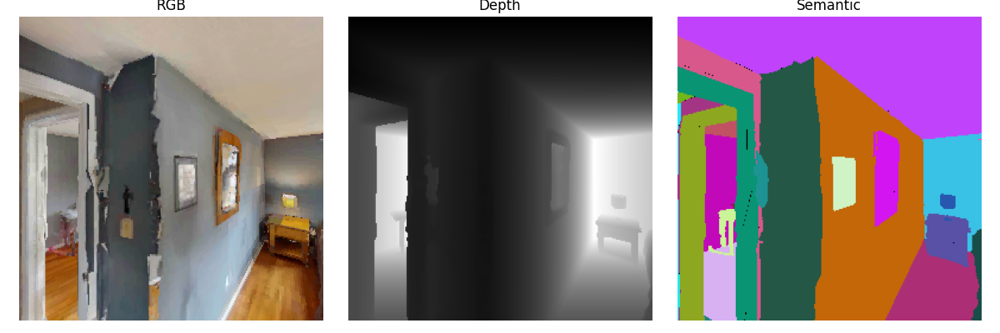

# 🏠 Habitat-Sim Docker

[](https://github.com/facebookresearch/habitat-sim/releases/tag/v0.2.5)
[](https://www.python.org/doc/versions/)
[](https://www.docker.com/)
[](https://docs.docker.com/compose/)
[](https://aihabitat.org/docs/habitat-sim/)
[](https://twitter.com/ai_habitat)

This repository provides a minimal Docker setup for running the Habitat-Sim (https://github.com/facebookresearch/habitat-sim) without requiring additional virtual environments inside the container. A `docker-compose.yml` is included to simplify setup and development.

## 📚 Table of Contents

- [🐳 Getting Started](#-getting-started)
  - [Install Docker & Docker Compose (NVIDIA GPU Support)](#install-docker--docker-compose-nvidia-gpu-support)
  - [Start Habitat-Sim with Docker](#start-habitat-sim-with-docker)
- [🚀 Testing Habitat-Sim](#-testing-habitat-sim)
  - [Use Habitat Interactive Viewer](#use-habitat-interactive-viewer)
  - [Save Habitat Sensor Observations](#save-habitat-sensor-observations)

## 🐳 Getting Started

### Install Docker & Docker Compose (NVIDIA GPU Support)

To install Docker and allow your user to run Docker commands without `sudo`, run:
```bash
curl https://get.docker.com | sh && sudo systemctl --now enable docker
sudo usermod -aG docker ${USER}
```
**Note**: You may need to log out and log back in for the group change to take effect.

Install the Nvidia Container Toolkit. Make sure the NVIDIA GPU driver is already installed on your system.

First, add the NVIDIA Container Toolkit repository:
```bash
curl -fsSL https://nvidia.github.io/libnvidia-container/gpgkey | sudo gpg --dearmor \
  -o /usr/share/keyrings/nvidia-container-toolkit-keyring.gpg \
  && curl -s -L https://nvidia.github.io/libnvidia-container/stable/deb/nvidia-container-toolkit.list \
  | sed 's#deb https://#deb [signed-by=/usr/share/keyrings/nvidia-container-toolkit-keyring.gpg] https://#g' \
  | sudo tee /etc/apt/sources.list.d/nvidia-container-toolkit.list
```
Then install the toolkit:
```bash
sudo apt update && sudo apt install nvidia-container-toolkit
```

Configure Docker runtime and restart Docker daemon:
```bash
sudo nvidia-ctk runtime configure --runtime=docker
sudo systemctl restart docker
```

To install Docker Compose, run the following command:
```bash
sudo apt install docker-compose-plugin
```

Verify Docker and Docker Compose Installation:
```bash
docker version
docker compose version
```

### Start Habitat-Sim with Docker

Clone this repository:
```bash
$ git clone https://github.com/iminolee/Habitat-Sim-Docker.git
```

Allow remote X connections (for GUI support):
```bash
xhost +
```

Build the Docker image:
```bash
$ cd Habitat-Sim-Docker/docker
$ docker compose build
```

Start the container in the background:
```bash
$ docker compose up -d
```

Access the running container:
```bash
$ docker exec -it habitat-sim bash
```

## 🚀 Testing Habitat-Sim

### Use Habitat Interactive Viewer

```bash
# Load default test scene (simple_room)
python test_sim_viewer.py

# Load HM3D test scene (wcojb4TFT35)
python test_sim_viewer.py --scene data/scene_datasets/test_scene/HM3D/00802-wcojb4TFT35/wcojb4TFT35.basis.glb
```
You can control an agent in these test scenes. Use **W/A/S/D keys** to move forward/left/backward/right and **Arrow keys or mouse (LEFT click)** to control gaze direction (look up/down/left/right).

<p align="center">
    
</p>

You can see the terminal logs for more available commands.

### Save Habitat Sensor Observations

```bash
python test_sim_sensor.py
```
<p align="center">
    
</p>